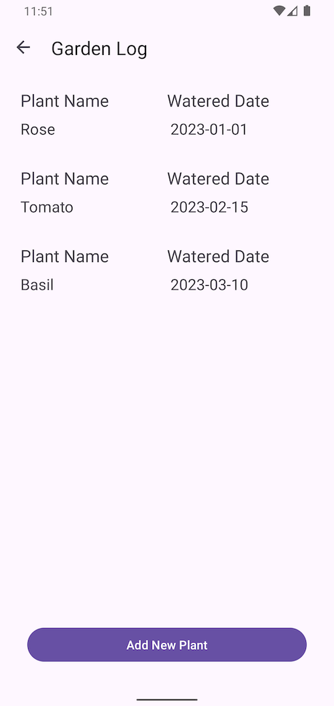
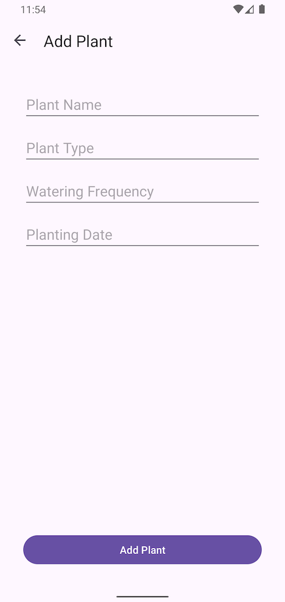

# Home Screen

In the Home Screen, only have two buttons
1. Show Garden Log
    - After first time app launch, show `pre-populated plant` list
    - If we have `added plant in the Room DB`, it gonna show in the list as well
   
2. Add Plant
    - can add plant in the `Room DB`

___

# Garden Log Screen

1. After first time app launch, show pre-populated plant list
2. If we have added plant in the Room DB, it gonna show in the list as well
3. Whenever click one of the item in the list, navigate to `Plant Details Screen`.
4. When click `Add New Plant`, navigate to `Add Plant Screen`.

___

# Add Plant Screen

1. Can `add` new plant into Room DB.
2. After click on `Add Plant`, navigate to `Garden Log Screen` which gonna `fetch data from DB` and show the list.

---

# Plant Details Screen

In this screen, only showing plant details.
1. `Query Plant Details` from Room DB by using `Plant ID` which is passed by `Garden Log Screen`.
